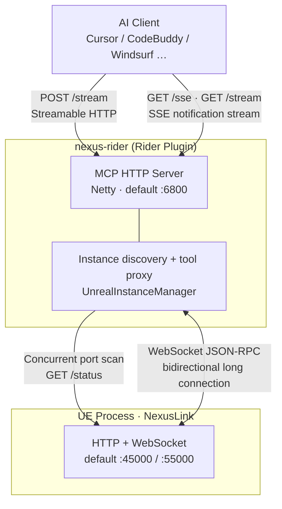
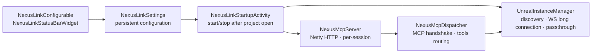
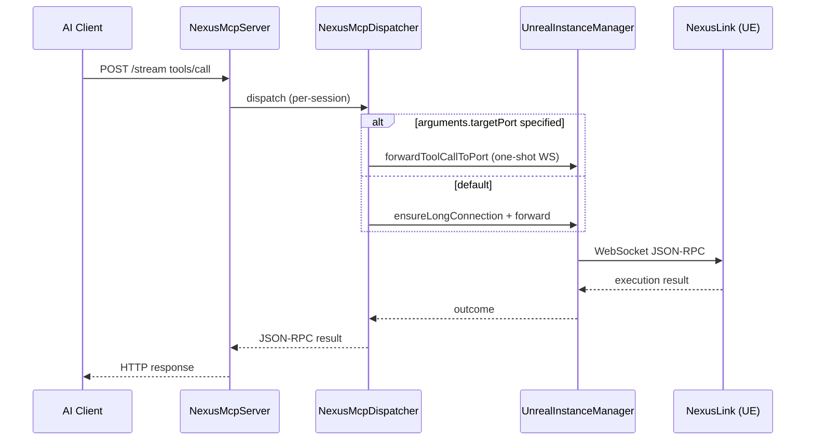

**Language / Language**: [简体中文](README.md) · **English**

# nexus-rider — Rider Plugin

**Current version: 1.3.6** · Plugin ID: `com.byteyang.nexusmcp`

JetBrains Rider MCP **proxy** plugin: runs a standalone MCP HTTP server locally (default `:6800`), auto-discovers UE instances, and forwards AI tool calls to the **NexusLink** UE plugin over WebSocket. Blueprint, asset, PIE, and other capabilities are provided by NexusLink on the UE side; this plugin does not implement game logic.

---

## What Is This

| Access mode | Endpoint | Best for |
|-------------|----------|----------|
| **Rider proxy** (this plugin) | `http://127.0.0.1:6800/stream` | JetBrains Rider users; auto-discover/switch across multiple UE instances |
| Direct UE connection | `http://127.0.0.1:45000/stream` | No IDE plugin needed; you must specify the UE port yourself |

Value of proxy mode: AI clients connect to a fixed port; Rider scans `45000`–`45100`, maintains WebSocket long connections, and switches between multiple Editor / PIE instances.

---

## Dependencies & Version Compatibility

| Component | Requirement |
|-----------|-------------|
| **nexus-rider** | ≥ 1.3.3 (aligned with UE `proxy_config.minProxyVersion`) |
| **NexusLink** (UE plugin) | `nexus-mcp-unreal-*.zip` from [NexusLink Releases](https://github.com/bytepine/NexusLink/releases); UE **4.26+** |
| **JetBrains Rider** | 2025.3+ (build `253`, compatible through `263.*`) |
| **JDK** (local build only) | 21 |

NexusLink installation: extract the zip into your UE project's `Plugins/Developer/NexusLink`, then enable the plugin in the editor. See [UE Prerequisites](#1-ue-prerequisites) below.

---

## Getting Releases

| Artifact | Source |
|----------|--------|
| `nexus-mcp-rider-<version>.zip` | [NexusRider Releases](https://github.com/bytepine/NexusRider/releases) |
| `nexus-mcp-unreal-<version>.zip` (NexusLink UE plugin) | [NexusLink Releases](https://github.com/bytepine/NexusLink/releases) |

You can also [build locally](#local-build-and-development) to produce a zip and install via **Settings → Plugins → Install Plugin from Disk**.

---

## Architecture Overview



**Data path**: AI clients connect to the Rider proxy via MCP HTTP; the proxy connects to UE via WebSocket JSON-RPC, avoiding MCP handshake overhead on the UE side. UE must enable the MCP server in Editor Preferences before it can be discovered by scanning.

### Internal Components



| Component | Responsibility |
|-----------|----------------|
| `NexusLinkStartupActivity` | Start/stop MCP service based on `enabled` after project open; periodically calls `maintainConnection` |
| `NexusMcpServer` | Netty HTTP server; `POST /stream` + `GET /sse`/`/stream`; per-session isolation via `Mcp-Session-Id` |
| `NexusMcpDispatcher` | JSON-RPC 2.0 parsing; `initialize` → `initialized` → `tools/list` / `tools/call` |
| `UnrealInstanceManager` | Port-scan discovery; WebSocket long connection; `list_unreal_instances` / `connect_unreal_instance`; remote tool passthrough |
| `ProxyConfig` | Caches UE-delivered `nexus/proxy_config`; drives connection tool copy and `initialize.instructions` |

### Tool Call Flow



---

## Installation & Usage

> **Open Project required**: MCP service starts in `ProjectActivity` — Rider must **open any project** (File → Open) before it listens on a port. On the welcome screen without an open project, the service will not start even if `enabled` is checked.

### 1. UE Prerequisites

NexusLink MCP HTTP/WebSocket **does not start by default**; you must enable it manually in UE:

1. Download `nexus-mcp-unreal-*.zip` from [NexusLink Releases](https://github.com/bytepine/NexusLink/releases) and extract to `Plugins/Developer/NexusLink`
2. **Edit → Plugins → Developer → NexusLink** — enable the plugin and restart the editor
3. **Edit → Editor Preferences → Plugins → NexusLink** — check **Enable MCP Server**
4. Takes effect immediately after save; toolbar/settings panel shows actual HTTP port (default `45000`) and WebSocket port (default `55000`)

When unchecked, Rider scan results are empty and the status bar shows **⬡ Nexus**.

### 2. Install Plugin

1. Download `nexus-mcp-rider-<version>.zip` from [NexusRider Releases](https://github.com/bytepine/NexusRider/releases), or [build locally](#local-build-and-development)
2. Rider → **Settings → Plugins → ⚙ → Install Plugin from Disk** → select the zip
3. Restart Rider and **open a project**
4. **Settings → Tools → Nexus MCP** → check **Enable Nexus MCP Server** (off by default; starts immediately when checked, default port `6800`)

### 3. Settings

Entry: **Settings → Tools → Nexus MCP**

| Setting | Default | Description |
|---------|---------|-------------|
| Enable Nexus MCP Server | `false` | Master switch; starts immediately when checked, stops when unchecked — no Rider restart needed |
| MCP port | `6800` | Port for AI client connections; **restart Rider after changing** |
| Scan port range | `45000`–`45100` | UE instance discovery range; toggle master switch off/on after changing |
| Scan interval | `5` s | Periodic discovery interval; same as above after changing |

The settings panel also provides **Streamable HTTP Config** and **SSE Config** buttons to generate AI client JSON snippets in a preview box for copying.

### 4. Status Bar

Rider bottom status bar shows UE connection state:

| Display | Meaning |
|---------|---------|
| **⬢ ProjectName** | Connected to a UE instance |
| **⬡ Nexus** | Not connected |

Click the status bar to open the instance list and switch targets with one click. No command-palette refresh command; relies on periodic scanning and immediate rescan on disconnect.

### 5. UE Instance Discovery

- **Strategy**: 20-thread concurrent scan of configured port range; `GET /status` per port to verify liveness and read project name, `netRole`, etc.
- **Auto-connect**: auto-connects when only one instance; with multiple instances, prefers `netRole=Editor`; manual switch via status bar
- **Preferred port**: records `preferredPort` after manual selection; prioritized on reconnect after disconnect/rescan
- **Steady-state optimization**: when long connection is alive, most rounds only heartbeat the current port; full scan every 6 rounds
- **Disconnect handling**: immediate async rescan; does not broadcast `tools/list_changed`, but keeps tool list cache; refreshes list on successful reconnect or MCP session `initialized`

---

## Proxy Tools Reference

Besides remote UE tools, the proxy layer provides 2 local tools (names and schema can be overridden by UE `proxy_config`; fallback below when not connected).

### `list_unreal_instances`

Discover all active UE instances in the current scan range.

**Parameters**: none (`inputSchema`: empty object)

**Returns** (`content[0].text` is a JSON array):

| Field | Type | Description |
|-------|------|-------------|
| `port` | int | UE HTTP port (use this value for `connect`) |
| `projectName` | string | Project name |
| `engineVersion` | string | Engine version |
| `netRole` | string | `Editor` / `DedicatedServer` / `ListenServer` / `Client` / `Standalone` |
| `connected` | bool | Whether this is the current long-connection target and WS is still OPEN |

### `connect_unreal_instance`

Connect to the UE instance on the specified port and set it as `preferredPort`.

**Parameters**:

```json
{ "port": 45000 }
```

### Remote Tools & `targetPort`

`tools/list` merges UE tool list when connected. `tools/call` forwards to the currently bound instance via long connection by default (timeout **120s**).

For concurrent multi-instance queries, add `targetPort` in `arguments` for a one-shot WebSocket without changing the long-connection binding:

```json
{
  "name": "call_capability",
  "arguments": {
    "targetPort": 45001,
    "capability": "get_editor_context",
    "arguments": {}
  }
}
```

---

## Feature List

### Standalone MCP Server (for AI Clients)

- [x] Netty-based HTTP/1.1 MCP server (not dependent on Rider built-in MCP)
- [x] Dual endpoints: `POST /stream` (Streamable HTTP) + `GET /sse` / `GET /stream` (SSE notification stream; both routes share the same handler)
- [x] Compatible with legacy MCP SSE transport (2024-11-05) and new Streamable HTTP (2025-03-26); negotiated version `2025-06-18`
- [x] JSON-RPC 2.0 + MCP session state machine (initialize/initialized/ping/tools)
- [x] Per-session isolation (`Mcp-Session-Id` header); multiple AI clients can connect concurrently without interference
- [x] Configurable listen port (default 6800); auto-increment on port conflict (up to 100 subsequent ports)

### UE Instance Discovery & Management

- [x] Port scan + `GET /status` real connectivity check (no stale dead-process entries)
- [x] Background periodic rediscovery (default every 5 seconds)
- [x] WebSocket long-connection communication (JSON-RPC, no MCP handshake overhead)
- [x] Multi-instance support: list all discovered UE instances and project info
- [x] `preferredPort` preserves manual user selection
- [x] Tool list cache retained during disconnect to avoid AI clients degrading tools/call to Tool not found

### IDE Integration

- [x] Settings panel (**Tools → Nexus MCP**): master switch, port and scan config, one-click copy AI client config
- [x] Status bar widget: real-time UE connection state; click to switch instances
- [x] Auto-push `notifications/tools/list_changed` on UE connect/disconnect

### MCP Tool Proxy

- [x] `list_unreal_instances` / `connect_unreal_instance` — see [Proxy Tools Reference](#proxy-tools-reference)
- [x] `initialize.instructions` — after connect, async fetch UE `nexus/instructions`; append `InitializeInstructions.*.md` to handshake response
- [x] Connection tool copy delivered by UE `nexus/proxy_config` (`ProxyConfig.json`); generic fallback when not connected
- [x] Remote tool passthrough: `tools/list` merges UE tools; `tools/call` forwards via long connection by default; `arguments.targetPort` uses one-shot WS

---

## AI Client Configuration

Default endpoint `http://127.0.0.1:6800/stream`. If MCP port is occupied and auto-incremented, use the actual port from Rider startup notification or settings panel. Binds to `127.0.0.1`; AI client must run on the same machine as Rider (or configure port forwarding yourself).

**Cursor** (`~/.cursor/mcp.json`, Streamable HTTP):

```json
{
  "mcpServers": {
    "nexus-rider": {
      "url": "http://127.0.0.1:6800/stream"
    }
  }
}
```

**CodeBuddy / Windsurf** (Streamable HTTP):

```json
"Nexus": {
  "url": "http://127.0.0.1:6800/stream",
  "transportType": "streamable-http",
  "description": "NexusLink MCP Server for Unreal Engine",
  "disabled": false
}
```

**SSE transport** (legacy MCP clients):

```json
"nexus-rider": {
  "url": "http://127.0.0.1:6800/sse"
}
```

---

## Local Build & Development

### Package Installer

```bash
py scripts/build_rider.py --version <ver> --output release/
```

The script temporarily injects version into `gradle.properties` / `plugin.xml`, injects change-notes from CHANGELOG, runs `gradlew buildPlugin`, then restores `0.0.0`.

Alternatively:

```bash
./gradlew buildPlugin    # Windows: gradlew.bat buildPlugin
# or
build.bat                # equivalent to gradlew clean buildPlugin
```

Output: `build/distributions/*.zip` (or the `--output` directory when using the script).

### Debug Plugin

```bash
./gradlew runIde
```

Requirements:

- **Rider 2025.3** installed locally (matches `platformVersion=2025.3` in `gradle.properties`)
- **JDK 21**
- `build.gradle.kts` uses `useInstaller = false` — relies on local IDE SDK rather than auto-download

Source directory: `src/main/kotlin/com/nexusmcp/mcp/`

For feature changes, update the `[Unreleased]` section in [CHANGELOG.md](CHANGELOG.md).

---

## Tech Stack

| Category | Choice |
|----------|--------|
| Language / Platform | Kotlin + IntelliJ Platform Plugin (Rider module) |
| MCP HTTP | Netty (`compileOnly`, reuses Rider built-in to avoid ClassLoader conflicts) |
| UE communication | Java-WebSocket client + `org.json` |
| Build | Gradle 9 + IntelliJ Platform Gradle Plugin 2.x |

---

## FAQ

### AI client shows "MCP initialization timeout"

- Confirm Rider has **opened a project** and **Enable Nexus MCP Server** is checked in settings
- Confirm UE has **Enable MCP Server** checked and NexusLink plugin is loaded
- Check that the AI client port matches Rider's actual listen port (default `6800`)
- Confirm Rider status bar shows **⬢ ProjectName** (connected to UE)

### Multiple Rider project windows

MCP service is mounted **per project**. With multiple projects open, windows may contend for `6800`; later windows auto-increment (`6801`…). Configure each AI client with the actual port from that window's startup notification.

### Multiple AI clients at once

Supports per-session isolation (`Mcp-Session-Id` header). Multiple AI clients can connect to the same Rider MCP server concurrently without interference.

### Multiple UE instances running

Each UE instance gets a different port automatically. Rider discovers all instances; select the target in the status bar. For concurrent multi-instance queries, see [targetPort example](#remote-tools--targetport).

### Tool list not refreshing

Proxy pushes `notifications/tools/list_changed` on UE connect/disconnect. If the AI client does not update, reconnect MCP or restart the AI session; proxy pre-warms `tools/list` and re-sends notification when `initialized` completes.

### View logs

Rider logs: `%LOCALAPPDATA%\JetBrains\Rider<version>\log\idea.log` (macOS/Linux: `~/Library/Logs/JetBrains/Rider<version>/idea.log`). Search for `Nexus MCP`.

### Modified UE assets but disk unchanged

NexusLink / UE-side behavior (e.g. `save_asset` persistence); unrelated to this proxy.

---

## Changelog

See [CHANGELOG.md](CHANGELOG.md).

---

## License

[MIT](LICENSE) © byteyang
