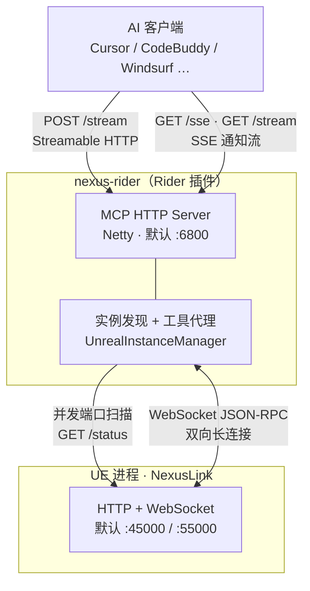
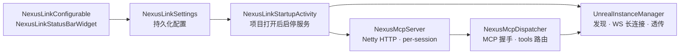
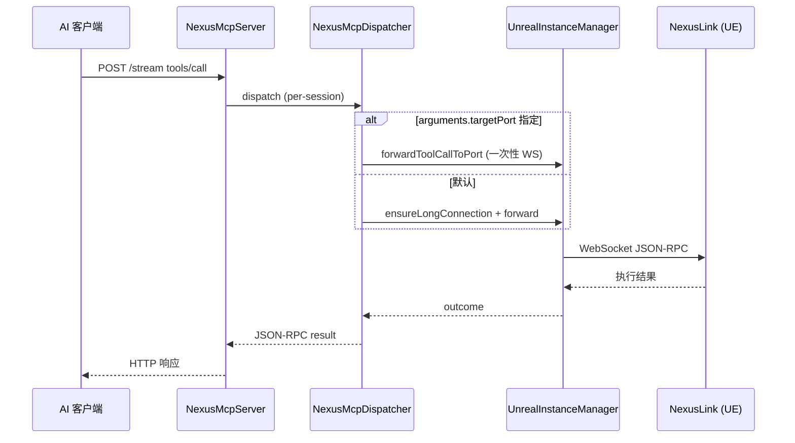

# nexus-rider — Rider 插件

**当前版本：1.3.6** · 插件 ID：`com.byteyang.nexusmcp`

JetBrains Rider 端 MCP **代理**插件：在本地运行独立 MCP HTTP 服务器（默认 `:6800`），自动发现 UE 实例，经 WebSocket 将 AI 工具调用转发给 **NexusLink** UE 插件。蓝图、资产、PIE 等具体能力均由 UE 侧 NexusLink 提供，本插件不实现游戏逻辑。

---

## 这是什么

| 接入方式 | 端点 | 适用 |
|----------|------|------|
| **Rider 代理**（本插件） | `http://127.0.0.1:6800/stream` | JetBrains Rider 用户；自动发现/切换多 UE 实例 |
| 直连 UE | `http://127.0.0.1:45000/stream` | 无需 IDE 插件；须自行指定 UE 端口 |

代理模式的价值：AI 客户端只连固定端口，由 Rider 负责扫描 `45000`–`45100`、维持 WebSocket 长连接、在多 Editor / PIE 实例间切换。

---

## 依赖与版本兼容

| 组件 | 要求 |
|------|------|
| **nexus-rider** | ≥ 1.3.3（与 UE `proxy_config.minProxyVersion` 对齐） |
| **NexusLink**（UE 插件） | 随 [NexusLink Releases](https://github.com/bytepine/NexusLink/releases) 发布的 `nexus-mcp-unreal-*.zip`；UE **4.26+** |
| **JetBrains Rider** | 2025.3+（build `253`，兼容至 `263.*`） |
| **JDK**（仅本地构建） | 21 |

NexusLink 安装：将 zip 解压到 UE 项目的 `Plugins/Developer/NexusLink`，在编辑器中启用插件。详见下方 [UE 前置条件](#1-ue-前置条件)。

---

## 获取发布版

| 产物 | 来源 |
|------|------|
| `nexus-mcp-rider-<version>.zip` | [NexusRider Releases](https://github.com/bytepine/NexusRider/releases) |
| `nexus-mcp-unreal-<version>.zip`（NexusLink UE 插件） | [NexusLink Releases](https://github.com/bytepine/NexusLink/releases) |

也可 [本地构建](#本地构建与开发) 生成 zip，通过 **Settings → Plugins → Install Plugin from Disk** 安装。

---

## 架构概览



**数据路径**：AI 客户端经 MCP HTTP 连 Rider 代理；代理经 WebSocket JSON-RPC 连 UE，省去 UE 侧 MCP 握手开销。UE 须在 Editor Preferences 中启用 MCP 服务器后才会被扫描到。

### 内部组件



| 组件 | 职责 |
|------|------|
| `NexusLinkStartupActivity` | 项目打开后按 `enabled` 启停 MCP 服务；定时调用 `maintainConnection` |
| `NexusMcpServer` | Netty HTTP 服务器；`POST /stream` + `GET /sse`/`/stream`；`Mcp-Session-Id` 会话隔离 |
| `NexusMcpDispatcher` | JSON-RPC 2.0 解析；`initialize` → `initialized` → `tools/list` / `tools/call` |
| `UnrealInstanceManager` | 端口扫描发现；WebSocket 长连接；`list_unreal_instances` / `connect_unreal_instance`；远端工具透传 |
| `ProxyConfig` | 缓存 UE 下发的 `nexus/proxy_config`，驱动连接工具文案与 `initialize.instructions` |

### 工具调用流程



---

## 安装与使用

> **须 Open Project**：MCP 服务在 `ProjectActivity` 中启动——Rider 必须**打开任意项目**（File → Open）后才会监听端口。仅启动 Rider 欢迎页、未打开项目时，即使勾选 `enabled` 也不会启动服务。

### 1. UE 前置条件

NexusLink 的 MCP HTTP/WebSocket **默认不启动**，须在 UE 中手动开启：

1. 从 [NexusLink Releases](https://github.com/bytepine/NexusLink/releases) 下载 `nexus-mcp-unreal-*.zip`，解压到 `Plugins/Developer/NexusLink`
2. **Edit → Plugins → Developer → NexusLink** — 启用插件并重启编辑器
3. **Edit → Editor Preferences → Plugins → NexusLink** — 勾选 **启用 MCP 服务器**
4. 保存后即时生效；工具栏/设置面板会显示实际 HTTP 端口（默认 `45000`）与 WebSocket 端口（默认 `55000`）

未勾选时 Rider 扫描结果为空、状态栏显示 **⬡ Nexus**。

### 2. 安装插件

1. 从 [NexusRider Releases](https://github.com/bytepine/NexusRider/releases) 下载 `nexus-mcp-rider-<version>.zip`，或 [本地构建](#本地构建与开发)
2. Rider → **Settings → Plugins → ⚙ → Install Plugin from Disk** → 选择 zip
3. 重启 Rider，**打开一个项目**
4. **Settings → Tools → Nexus MCP** → 勾选 **启用 Nexus MCP 服务器**（默认关闭；勾选后立即启动，默认端口 `6800`）

### 3. 配置项

入口：**Settings → Tools → Nexus MCP**

| 配置项 | 默认值 | 说明 |
|--------|--------|------|
| 启用 Nexus MCP 服务器 | `false` | 总开关；勾选后立即启动、取消后立即停止，无需重启 Rider |
| MCP 端口 | `6800` | AI 客户端连接端口；**修改后需重启 Rider** |
| 扫描端口范围 | `45000`–`45100` | UE 实例发现范围；修改后需重启 MCP 服务（关开总开关即可） |
| 扫描间隔 | `5` 秒 | 定时发现间隔；修改后同上 |

设置面板还提供「**Streamable HTTP 配置**」「**SSE 配置**」按钮，在预览框生成 AI 客户端 JSON 片段供复制。

### 4. 状态栏

Rider 底部状态栏显示 UE 连接状态：

| 显示 | 含义 |
|------|------|
| **⬢ 项目名** | 已连接到 UE 实例 |
| **⬡ Nexus** | 未连接 |

点击状态栏弹出实例列表，可一键切换连接目标。无命令面板刷新命令，依赖定时扫描与断连后立即重扫。

### 5. UE 实例发现

- **策略**：20 线程并发扫描配置的端口范围，每端口 `GET /status` 校验存活并读取项目名、`netRole` 等
- **自动连接**：仅一个实例时自动连接；多实例时优先 `netRole=Editor`，可在状态栏手动切换
- **偏好端口**：用户手动选择后记录 `preferredPort`，断连重扫时优先恢复
- **稳态优化**：长连接存活时多数轮次仅心跳探测当前端口，每 6 轮做一次全量扫描
- **断线处理**：立即异步重扫；不广播 `tools/list_changed`，但保留工具列表缓存；重连成功或 MCP 会话 `initialized` 时刷新清单

---

## 代理工具参考

除 UE 远端工具外，代理层自带 2 个本地工具（名称与 schema 可由 UE `proxy_config` 覆盖，未连接时使用下列 fallback）。

### `list_unreal_instances`

发现当前扫描范围内所有活跃 UE 实例。

**参数**：无（`inputSchema`: 空 object）

**返回**（`content[0].text` 为 JSON 数组）：

| 字段 | 类型 | 说明 |
|------|------|------|
| `port` | int | UE HTTP 端口（`connect` 时使用此值） |
| `projectName` | string | 项目名 |
| `engineVersion` | string | 引擎版本 |
| `netRole` | string | `Editor` / `DedicatedServer` / `ListenServer` / `Client` / `Standalone` |
| `connected` | bool | 是否为当前长连接目标且 WS 仍为 OPEN |

### `connect_unreal_instance`

连接到指定端口的 UE 实例，并设为 `preferredPort`。

**参数**：

```json
{ "port": 45000 }
```

### 远端工具与 `targetPort`

`tools/list` 在已连接时合并 UE 工具列表。`tools/call` 默认经长连接转发到当前绑定实例（超时 **120s**）。

多实例并发查询时，在 `arguments` 中附加 `targetPort`，走一次性 WebSocket，不改动长连接绑定：

```json
{
  "name": "call_capability",
  "arguments": {
    "targetPort": 45001,
    "capability": "get_editor_context",
    "arguments": {}
  }
}
```

---

## 功能列表

### 独立 MCP 服务器（面向 AI 客户端）

- [x] 基于 Netty 的 HTTP/1.1 MCP 服务器（不依赖 Rider 内置 MCP）
- [x] 双端点：`POST /stream`（Streamable HTTP）+ `GET /sse` / `GET /stream`（SSE 通知流，两路由共用同一处理器）
- [x] 兼容 MCP 旧 SSE 传输（2024-11-05）和新 Streamable HTTP（2025-03-26）双协议；协商版本 `2025-06-18`
- [x] JSON-RPC 2.0 协议 + MCP 会话状态机（initialize/initialized/ping/tools）
- [x] per-session 会话隔离（`Mcp-Session-Id` header），多 AI 客户端并发连接互不干扰
- [x] 监听端口可配置（默认 6800），端口冲突自动顺延（最多尝试后续 100 个端口）

### UE 实例发现与管理

- [x] 端口扫描 + `GET /status` 真实连通性校验（不保留死进程残留）
- [x] 后台定时自动重新发现（默认每 5 秒）
- [x] WebSocket 长连接通信（JSON-RPC，无 MCP 握手开销）
- [x] 多实例支持：列出所有发现的 UE 实例及其项目信息
- [x] `preferredPort` 保留用户手动选择
- [x] 断线期间保留工具列表缓存，避免 AI 客户端将 tools/call 降级为 Tool not found

### IDE 集成

- [x] 设置面板（**Tools → Nexus MCP**）：总开关、端口与扫描配置、一键复制 AI 客户端配置
- [x] 状态栏组件：实时显示 UE 连接状态，点击切换实例
- [x] UE 连接/断开时自动推送 `notifications/tools/list_changed`

### MCP 工具代理

- [x] `list_unreal_instances` / `connect_unreal_instance` — 见 [代理工具参考](#代理工具参考)
- [x] `initialize.instructions` — 连接后异步拉取 UE `nexus/instructions`，拼接 `InitializeInstructions.*.md` 到握手响应
- [x] 连接工具文案由 UE `nexus/proxy_config`（`ProxyConfig.json`）下发；未连接时使用通用 fallback
- [x] 远端工具透传：`tools/list` 合并 UE 工具列表；`tools/call` 默认经长连接转发；`arguments.targetPort` 走一次性 WS

---

## AI 客户端配置

默认端点 `http://127.0.0.1:6800/stream`。若 MCP 端口被占用自动顺延，以 Rider 启动通知或设置面板显示的实际端口为准。通信绑定 `127.0.0.1`，AI 客户端须与本机 Rider 同机（或自行配置端口转发）。

**Cursor**（`~/.cursor/mcp.json`，Streamable HTTP）：

```json
{
  "mcpServers": {
    "nexus-unreal": {
      "url": "http://127.0.0.1:6800/stream"
    }
  }
}
```

**CodeBuddy / Windsurf**（Streamable HTTP）：

```json
"Nexus": {
  "url": "http://127.0.0.1:6800/stream",
  "transportType": "streamable-http",
  "description": "NexusLink MCP Server for Unreal Engine",
  "disabled": false
}
```

**SSE 传输**（旧版 MCP 客户端）：

```json
"nexus-unreal": {
  "url": "http://127.0.0.1:6800/sse"
}
```

---

## 本地构建与开发

### 打包安装包

```bash
./gradlew buildPlugin    # Windows: gradlew.bat buildPlugin
# 或
build.bat                # 等价于 gradlew clean buildPlugin
```

产物：`build/distributions/*.zip`。

### 调试插件

```bash
./gradlew runIde
```

要求：

- 本机已安装 **Rider 2025.3**（与 `gradle.properties` 中 `platformVersion=2025.3` 一致）
- **JDK 21**
- `build.gradle.kts` 使用 `useInstaller = false`，依赖本地 IDE SDK 而非自动下载

源码目录：`src/main/kotlin/com/nexusmcp/mcp/`

功能变更请更新 [CHANGELOG.md](CHANGELOG.md) 的 `[Unreleased]` 区块。

---

## 技术栈

| 类别 | 选型 |
|------|------|
| 语言 / 平台 | Kotlin + IntelliJ Platform Plugin（Rider 模块） |
| MCP HTTP | Netty（`compileOnly`，复用 Rider 内置，避免 ClassLoader 冲突） |
| UE 通信 | Java-WebSocket 客户端 + `org.json` |
| 构建 | Gradle 9 + IntelliJ Platform Gradle Plugin 2.x |

---

## 常见问题

### AI 客户端显示「MCP 初始化超时」

- 确认 Rider 已**打开项目**，且设置中勾选 **启用 Nexus MCP 服务器**
- 确认 UE 已勾选 **启用 MCP 服务器**，且 NexusLink 插件已加载
- 检查 AI 客户端配置的端口是否为 Rider 实际监听端口（默认 `6800`）
- 确认 Rider 状态栏显示 **⬢ 项目名**（已连 UE）

### 多个 Rider 项目窗口

MCP 服务按**项目**挂载。同时打开多个项目时，各窗口可能争用 `6800`；后续窗口会自动顺延端口（`6801`…），请以各窗口启动通知中的实际端口配置 AI 客户端。

### 多个 AI 客户端同时使用

支持 per-session 会话隔离（`Mcp-Session-Id` header）。多个 AI 客户端可同时连接同一 Rider MCP 服务器，互不干扰。

### 多个 UE 实例同时运行

每个 UE 实例自动分配不同端口。Rider 自动发现所有实例，在状态栏选择目标即可。多实例并发查询见 [targetPort 示例](#远端工具与-targetport)。

### 工具列表不刷新

UE 连接/断开后代理会推送 `notifications/tools/list_changed`。若 AI 客户端未更新，尝试重连 MCP 或重启 AI 会话；代理在 `initialized` 完成时会预热 `tools/list` 并补发通知。

### 查看日志

Rider 日志：`%LOCALAPPDATA%\JetBrains\Rider<version>\log\idea.log`（macOS/Linux：`~/Library/Logs/JetBrains/Rider<version>/idea.log`）。搜索关键字 `Nexus MCP`。

### 修改了 UE 资产但磁盘未变化

属 NexusLink / UE 侧行为（如 `save_asset` 落盘），与本代理无关。

---

## 变更记录

见 [CHANGELOG.md](CHANGELOG.md)。

---

## License

[MIT](LICENSE) © byteyang
